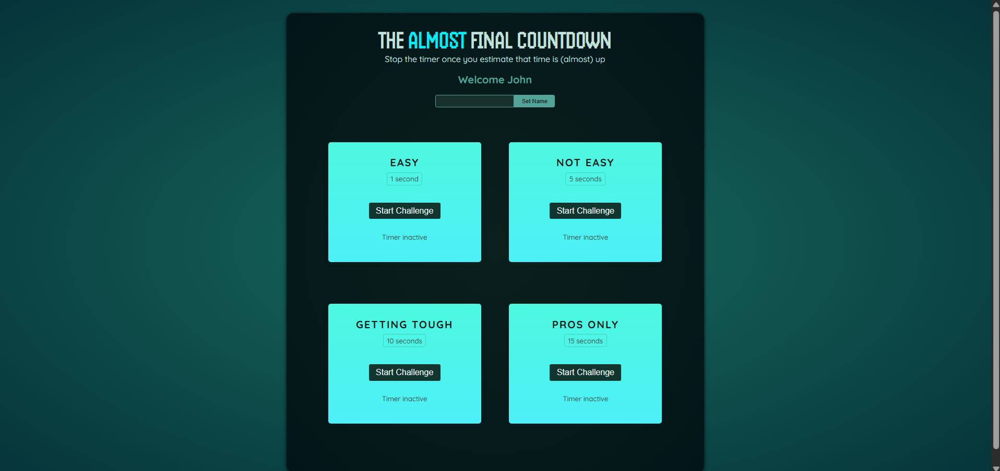
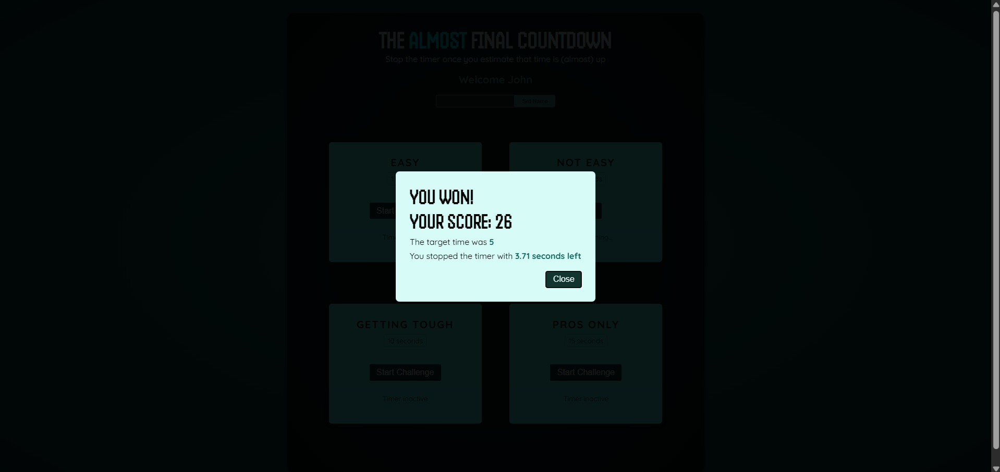
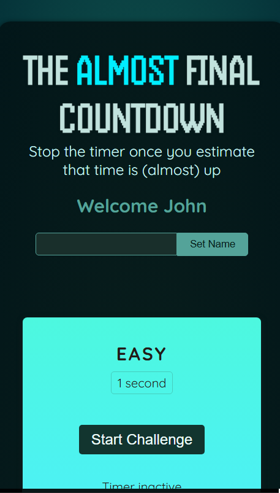
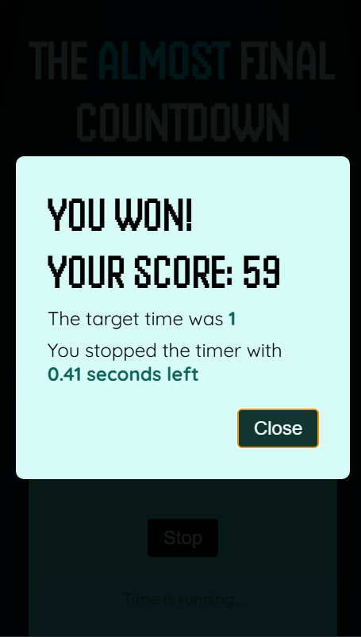

# *⏳ Timer Game*

**Timer Game** to gra, w której gracz musi zatrzymać stoper jak najbliżej końca w celu uzyskania najlepszego wyniku.

**Screnshots**








## **✔ Funkcjonalności**
* **Edytowanie nicku gracza** każdy gracz może dowolnie zmienić swój nick.
* **Poziomy** cztery dostępne tryby z rosnącym poziomem trudności.
* **Wynik** gra kończy się zwycięstwem z podaną liczbą punktów zależną lub porażką.

## **🛠 Technologie**
* **React (useRef, useState, Portal, imperativeHandle) ** – biblioteka do budowy interfejsu użytkownika.
* **CSS** – stylowanie aplikacji.
* **JavaScript (ES6+)** – logika aplikacji


## **🚀 Uruchomienie**
1. **Zainstaluj zależności**:
   ```sh
   npm install

2. **Uruchom aplikację**
   ```sh
   npm start
3. **Otwórz w przeglądarce**:
Wyswietlony: htttp://localhost:{PORT}